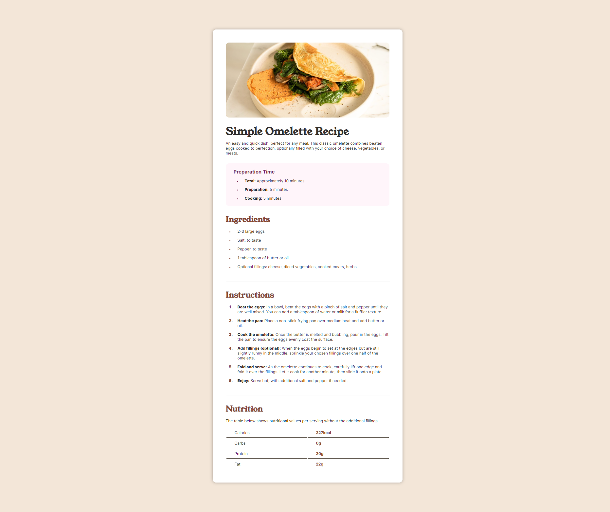

# Frontend Mentor - Blog preview card solution

This is a solution to the [Recipe page challenge on Frontend Mentor](https://www.frontendmentor.io/challenges/recipe-page-KiTsR8QQKm). Frontend Mentor challenges help you improve your coding skills by building realistic projects. 

## Table of contents

- [Frontend Mentor - Blog preview card solution](#frontend-mentor---blog-preview-card-solution)
  - [Table of contents](#table-of-contents)
  - [Overview](#overview)
    - [The challenge](#the-challenge)
    - [Screenshot](#screenshot)
    - [Links](#links)
  - [My process](#my-process)
    - [Built with](#built-with)
    - [What I learned](#what-i-learned)
    - [Useful resources](#useful-resources)
  - [Author](#author)

## Overview

### The challenge

Users should be able to:

- Do your research on various HTML elements and ensure you use the most appropriate element based on the content

### Screenshot

### Links

- [Live Site Version](https://sillyq.github.io/fed-recipepage)

## My process

### Built with

- Semantic HTML5 markup
- CSS custom properties
- Flexbox

### What I learned

- a LOT more about HTML tags and CSS properties
- how to use measurement units for aligning or styling the page
- making the page resonsive for smaller devices
- organizing files and CSS selectors

### Useful resources

- [ChatGPT](https://chatgpt.com) - A buddy. not quite helpful but ok
- [W3Schools](https://www.w3schools.com) - Perfect documentation for everything about HTML & CSS
- [StackOveflow]() - Browse over the internet to find solutions (and some didn't showed up so im screwed)

## Author

- Website - [sillyq.github.io](https://sillyq.github.io)
- Frontend Mentor - [@sillyq](https://www.frontendmentor.io/profile/sillyq)
- Twitter - [@qwrrrt_](https://www.twitter.com/qwrrrt_)